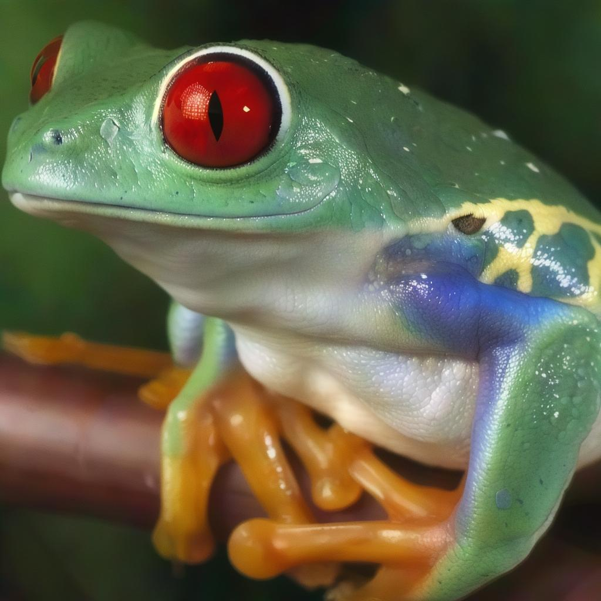

# PASD Magnify Cog

This is an implementation of [PASD MAgnify](https://huggingface.co/spaces/fffiloni/PASD) as a [Cog](https://github.com/replicate/cog) model.

## Development

Follow the [model pushing guide](https://replicate.com/docs/guides/push-a-model) to push your own fork of SDXL to [Replicate](https://replicate.com).

## Basic Usage

Git clone this repo and the PASD one:

    git clone https://github.com/lucataco/cog-PASD-Magnify
    cd cog-PASD-Magnify
    git clone https://github.com/yangxy/PASD

Download the weights to the proper folder:

    PASD/checkpoints

Run a prediction:

    cog predict -i image=@frog.png

